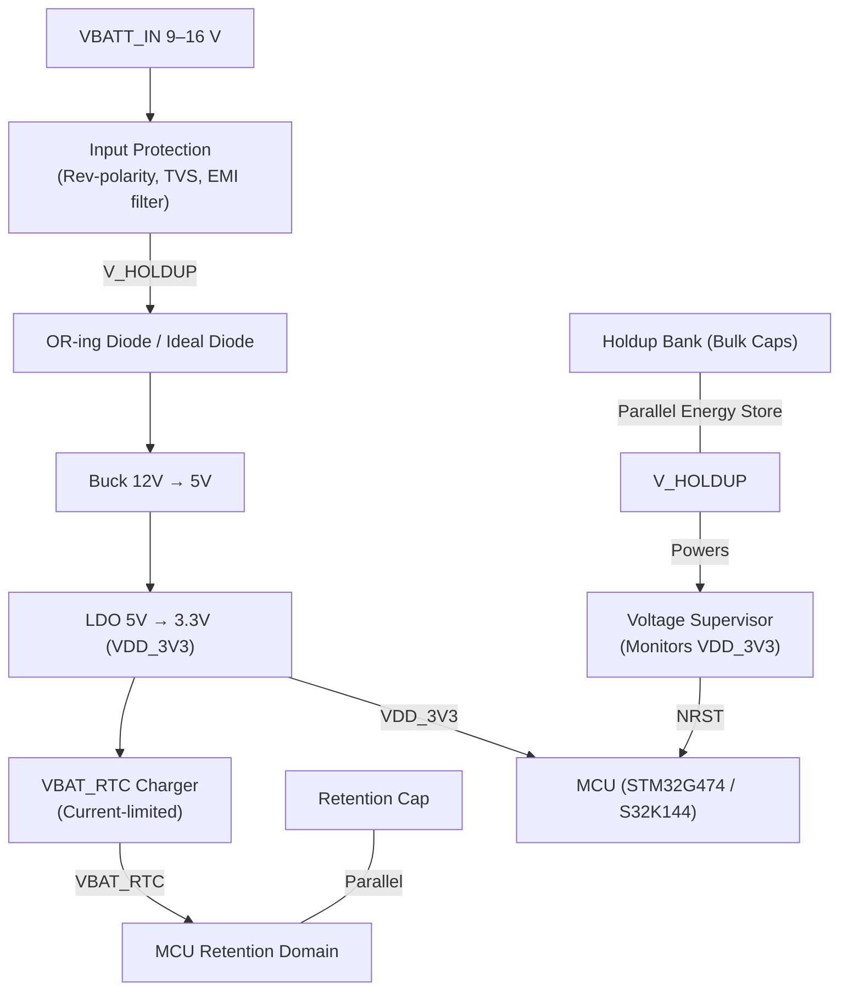
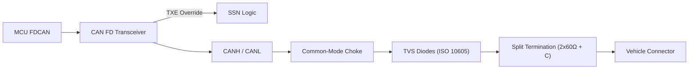

| Field | Value |
|---|---|
| **Document** | CANcestry Hardware Architecture Description |
| **Version** | 0.1.0 |
| **Status** | Draft — for QA review (HW-PLAN §10.7 audit point) |
| **Owner** | System Engineer |
| **Approver** | QA Lead |
| **Last Review** | 2026-09-19 |
| **Repository location** | `docs/hw/HAD.md` |
| **Governing documents** | `docs/hw/HW-PLAN.md` v1.0.0, `docs/hw/HwRS.md` v0.1.0 |

---

## 1. Purpose and Scope
This document describes the physical and logical architecture of the CANcestry hardware platform. It translates the requirements of the `HwRS.md` into a structural blueprint, defining power topology, safety mechanisms, communication interfaces, and component boundaries. 

This document is the authoritative source for the Capella Physical Architecture (PA) model. Any divergence between this document and the Capella model will be flagged by `ci/check_capella_model.py`.

## 2. System Context
The CANcestry board operates as an intermediary gateway between a Vehicle Control Unit (VCU) and an aftermarket/replacement Battery Management System (BMS), with an optional diagnostic tap. It draws power from the vehicle's 12V/24V nominal bus and must maintain a deterministic, fail-safe state under all fault conditions, including loss of main power.

## 3. Power Architecture
The power tree is designed to guarantee energy availability for safety-critical shutdown sequences (HW-SF-004) and to maintain strict voltage tolerances (HW-FR-00X).

**Key Architectural Decisions:**
1. **Parallel Holdup**: The holdup bank is placed in parallel with the buck input via an OR-ing diode. This prevents back-feeding into the input protection network during a brownout and ensures the buck receives uninterrupted power long enough to execute the safe-state sequence.
2. **Supervisor Topology**: The voltage supervisor is powered by `V_HOLDUP` (ensuring it remains active during input collapse) but *monitors* `VDD_3V3`. This guarantees `NRST` is asserted if the buck or LDO fails, not just if the 12V input drops.
3. **Dedicated Retention**: `VBAT_RTC` is isolated from the main `VDD_3V3` rail via a current-limited charger and its own holdup capacitor, satisfying the strong form of HW-SF-002.

## 4. Safety Architecture

### 4.1 Safe-State Network (SSN)
The SSN (HW-SF-001) is a firmware-independent hardware circuit that forces the system into a safe state when `NRST` is asserted or when the supervisor detects a critical fault. It overrides MCU GPIOs to prevent contention.

| Controlled Signal | Normal State (Firmware Running) | Safe State (NRST Asserted / SSN Active) | Override Mechanism | Fault Tolerance |
|---|---|---|---|---|
| **TXE1..3** (Transceiver Enable) | Low (Enabled) | High (Disabled) | SSN open-drain pulls high via 1kΩ series resistor. | Prevents contention if MCU GPIO is stuck low. |
| **CONT_EN** (Contactor Driver) | High (Contactor On) | Low (Contactor Off) | SSN drives gate of series P-FET on `CONT_EN` path, cutting power to driver enable. | Single fault (MCU stuck high) handled by P-FET cutoff. |
| **TERM_SEL** (Termination Select) | Defined per channel role | Open (Termination Disconnected) | SSN pulls analog switch select lines to defined default (high-Z). | Prevents bus loading if node is unpowered. |

### 4.2 Watchdog and Reset
- **Primary**: Internal MCU IWDG clocked by LSI (HW-SF-003).
- **Secondary**: External voltage supervisor asserts `NRST` on `VDD_3V3` undervoltage.
- **Escalation**: If the IWDG is not fed within the 12–20 ms window, the MCU resets, GPIOs go high-impedance, and the SSN immediately asserts the safe state.

## 5. Communication Architecture
Each of the three CAN FD channels includes discrete physical layer protection to meet automotive EMC/ESD standards (HW-FR-004).

**Key Architectural Decisions:**
1. **Split Termination**: Used on all channels to improve CAN FD EMC performance by filtering common-mode noise during fast edge rates.
2. **TVS Diodes**: Rated for ±8kV contact / ±15kV air discharge, protecting against ISO 10605 and short-to-battery faults.

## 6. Traceability Matrix (Architecture to Requirements)

| Architecture Block | HwRS Requirement(s) | Capella LA Component |
|---|---|---|
| Input Protection + Holdup + OR-Diode | HW-FR-004, HW-SF-004 | `PowerSupervisor` |
| Buck + LDO Regulators | *(Pending HW-FR-00X addition)* | `PowerSupervisor` |
| Voltage Supervisor + IWDG | HW-SF-003, HW-SF-005 | `SafetyMonitor` |
| Safe-State Network (SSN) | HW-SF-001 | `FailSafeLatch` |
| Retention Domain (VBAT_RTC) | HW-SF-002 | `RetentionDomain` |
| CAN Transceivers + Protection | HW-FR-002, HW-FR-003, HW-FR-004 | `CanPhy` |
| MCU + Crystals (HSE/LSE) | HW-FR-001, HW-FR-006, HW-FR-007 | `PA: MCU` |
| Test Access (SWD, Shunts, TPs) | HW-FR-008 | `TestInterface` |

*Note: Missing HwRS IDs (e.g., for Buck/LDO tolerances, Contactor driver single-fault) will be added in HwRS v0.2.0 and this table will be updated accordingly.*

## 7. Open Trades (To be resolved before PA freeze)

| Trade ID | Description | Impact | Target Resolution |
|---|---|---|---|
| **T-01** | Third CAN Controller: On-chip 3rd instance (S32K-class) vs. SPI CAN-FD companion IC. | MCU selection, HAL complexity, BOM cost. | H-Phase 2 |
| **T-02** | Watchdog: Internal IWDG only vs. Internal + External window supervisor. | ASIL-B single-fault coverage (HW-SF-005). | H-Phase 2 |
| **T-03** | Retention: Populate supercap vs. DNP footprint. | Determines strong vs. weak form of SW-FR-LOG-004. | H-Phase 2 |
| **T-04** | Termination Default: Per-channel termination default state during SSN activation. | Bus topology compliance when node is unpowered. | H-Phase 2 |

---

## 8. Change Log

| Version | Date | Change |
|---|---|---|
| 0.1.0 | 2026-09-19 | Initial draft incorporating QA review findings: corrected parallel holdup topology, explicit SSN state table, added CAN line protection, disambiguated VBAT_RTC, and added traceability matrix. |

***

### Next Steps for the Team:
1. **QA Review**: Please review this `HAD.md` draft against your §10.7 checklist. 
2. **HwRS Sync**: I will simultaneously draft the missing HwRS requirements (Buck/LDO tolerances, Contactor driver single-fault) so the traceability matrix in Section 6 is 100% complete upon merge.
3. **Capella Modeling**: Once approved, this document becomes the exact blueprint for the Capella PA model in Issue H-02.

Does this structure and level of detail meet your expectations for the normative architecture baseline?
